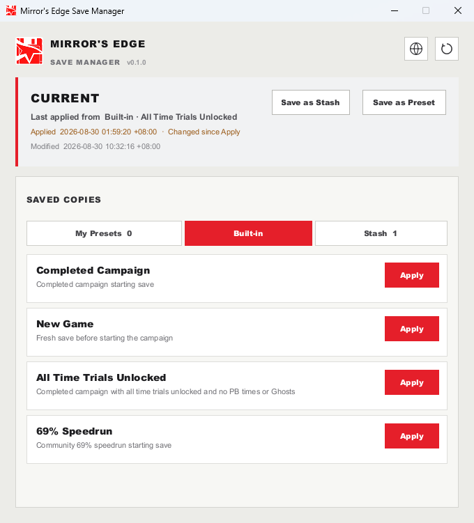

# Mirror's Edge Save Manager

[](LICENSE)
[](#requirements)
[](https://github.com/Vwings/mirrors-edge-save-manager/actions/workflows/ci.yml)

[English](README.md) · [简体中文](README.zh-CN.md)

**[Download the latest release](https://github.com/Vwings/mirrors-edge-save-manager/releases/latest)** · [Changelog](CHANGELOG.md)


An unofficial Windows utility for organizing and safely switching Mirror's Edge
(2008) PC save files.



## What it does

While playing Mirror's Edge, you may want to keep a completed run, try another
save, or return to an earlier state at any time. Save Manager is built for
these moments: keep your saves together and switch between them safely without
hunting for and copying `.dat` files by hand.

In the app, a save file can have one of three roles. All three are the same
game `.dat` format; the difference is whether the game is using the file and
what you keep it for:

- **Current** — the save the game is using now, kept in the game's save folder.
- **Preset** — a save you keep as a reusable starting point.
- **Stash** — a save you keep as a backup or history; one is created
  automatically before every Apply.

When you apply a Preset or Stash, the manager first saves Current as a Stash,
then switches and checks the result. The selected copy is never overwritten,
so you can try different saves and return to an earlier state whenever needed.

Save Manager works with complete save files. It does not edit or generate
progress data.

### Built-in Presets

The manager includes four read-only Presets for common starting points:

- **New Game** — a clean starting save for a fresh playthrough.
- **Completed Campaign** — the main campaign is complete, so you can access
  the completed-game state without replaying every mission.
- **69% Speedrun** — the community starting save for the 69% category.
- **All Time Trials Unlocked** — a completed-campaign save with Time Trials
  unlocked, ready for time-trial practice.

Built-in Presets are embedded in the application and cannot be edited or
deleted. They appear in their own **Built-in** tab, separate from user-created
saves in **My Presets**.

## Features

- Find the game's save folder and the current save automatically.
- Save Current as a Preset or Stash with a name and description.
- Import an external `.dat` file as a Preset.
- Clear all Stash history at once after an explicit confirmation.
- Edit or permanently delete user-created Presets and Stashes with explicit
  confirmation; built-in Presets remain read-only.
- Switch safely between Presets and Stashes without changing the source copy.
- Back up Current automatically before every switch.
- Check file integrity before and after each operation.
- Recover an interrupted operation without losing the original save.
- Avoid storing duplicate Presets, and avoid creating a Stash when any verified
  saved copy already preserves the same content.
- Record the last Apply source and changed-since-Apply state with saves captured
  from Current so Stash history remains identifiable.
- Show the last manager-applied source on Current and whether Current still
  matches the applied bytes.
- Include four verified, read-only built-in Presets for common starting points.
- Support English and Simplified Chinese, with your choice saved automatically.

## Requirements

- Windows 10 or Windows 11, x64
- Mirror's Edge for PC
- A writable game save location

On first use, launch the game once so it creates its native save directory.
The manager resolves the Windows **Documents known folder** and uses the game's
standard `EA Games\\Mirror's Edge\\TdGame\\Savefiles\\` location.

## Install and launch

Download `mirrors-edge-save-manager-windows-x64.zip` from the repository's
[Releases](https://github.com/Vwings/mirrors-edge-save-manager/releases/latest)
page. Extract the archive, place `mirrors-edge-save-manager.exe` wherever you
like, and run it. There is no installer.

Keep the executable wherever convenient. User data is stored separately under:

```text
%LOCALAPPDATA%\\Mirror's Edge Save Manager\\
```

Each Stored Save has its own directory:

```text
%LOCALAPPDATA%\\Mirror's Edge Save Manager\\
├─ stored-saves\\<id>\\metadata.json
├─ stored-saves\\<id>\\payload.dat.gz
├─ transactions\\<id>.json
└─ settings.json
```

`metadata.json` describes the save, `payload.dat.gz` contains its compressed
copy, `transactions` holds recovery journals, and `settings.json` stores
preferences such as the selected language.

## Everyday workflow

1. Close Mirror's Edge before changing a save. Mutating actions are disabled
   while `MirrorsEdge.exe` is running.
2. Open the manager and review **Current**, including its last Apply source and
   whether the active bytes have changed since that Apply.
3. Use **Save as Stash** for a safety checkpoint, or **Save as Preset** for a
   reusable starting point. Review the timestamped suggested name, add an
   optional description, and confirm.
4. Use **Import .dat** to add a save supplied by another source. Choose a clear
   alias and optional description; the source file is never modified.
5. Select a Preset or Stash and choose **Apply**. The confirmation shows that
   Current will be backed up automatically before the selected copy is applied.
6. Use the **Stash** tab to restore an earlier state. A Stash can be promoted to
   a Preset with **Make Preset**. User-created Presets and Stashes can also be
   renamed, described, or permanently deleted after confirmation. Use
   **Clear Stash** to remove the complete Stash history after one additional
   confirmation; Current and Presets remain unchanged.

If Current is missing but the save directory exists, the first activation flow
asks you to confirm the account-derived `<username>.dat` filename before it
creates one. Other `.dat` files in that directory are treated as history and
are not guessed to be Current.

## Safety model

Every mutating operation uses one application lock and checks the game process.
Before replacement, the manager rechecks both the process state and Current's
fingerprint. It stages the new bytes beside Current, verifies them, keeps a
same-directory rollback copy, and only commits after reopening and verifying
the result. If verification fails, the original Current remains available or
is restored automatically.

The manager never deletes the only verified Current first. Still keep normal
system backups and cloud-save backups; no software can protect against every
disk, account, or hardware failure.

## Troubleshooting

**Apply is disabled** — Close Mirror's Edge and refresh the window. If the
native save directory is missing, launch the game once and return to the
manager.

**A replacement fails** — Close the game and any tools that may hold the save
file open. Do not delete transaction artifacts while recovery is being
reported.

**The manager reports blocked recovery** — Leave the listed files untouched and
follow the on-screen recovery guidance. The application blocks new mutations
when it cannot prove which bytes are safe.

**The language did not change** — Select `EN` or `中文` in the top bar, then
wait for the interface to refresh. The explicit choice is saved automatically.

## Update and removal

The application is a standalone executable. To update it, close the game and
all running manager instances, then replace the executable with the newer
version. Stored Saves and settings remain under LocalAppData. If a newer build
does not support existing persisted-data schemas, it reports the unsupported
data instead of rewriting or discarding it.

Removing the executable does not remove Stored Saves. To remove all application
data as well, first finish or resolve any reported recovery operation, keep any
copies you still need, close the manager, and then delete
`%LOCALAPPDATA%\Mirror's Edge Save Manager\` manually.

## Scope

- Windows x64 is the supported platform.
- Save files are copied and restored as complete files; progress editing is
  outside the manager's scope.
- Stashes remain available until you remove them individually or clear the
  Stash collection.
- Built-in Presets are read-only sources.

## For contributors

Development commands, safety boundaries, localization workflow, and release
verification are documented in [`CONTRIBUTING.md`](CONTRIBUTING.md). Product
behavior and storage guarantees are specified in [`docs/design.md`](docs/design.md).

## License and attribution

The application is licensed under [GPL-3.0-only](LICENSE). Two bundled Presets
come from the Mirror's Edge speedrunning community:

- [69% save](https://www.speedrun.com/me/resources/4gwtx) by Toyro98
- [Completed campaign save](https://www.speedrun.com/me/resources/62y3z) by Phillotrax

Bundled save assets have separate provenance and redistribution notes in
[`resources/built-in/NOTICE.md`](resources/built-in/NOTICE.md).

This project is unofficial and is not affiliated with or endorsed by Electronic
Arts or DICE.
